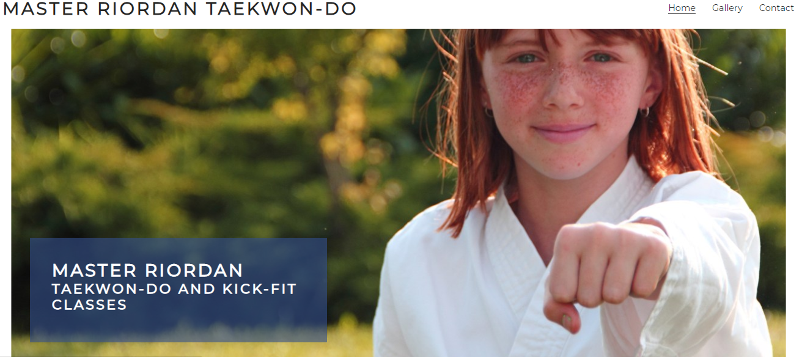
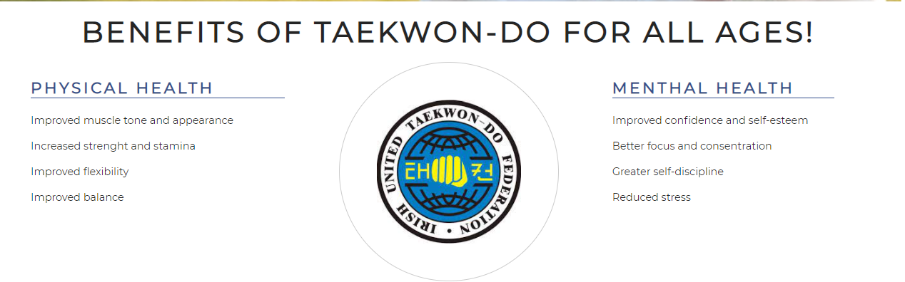
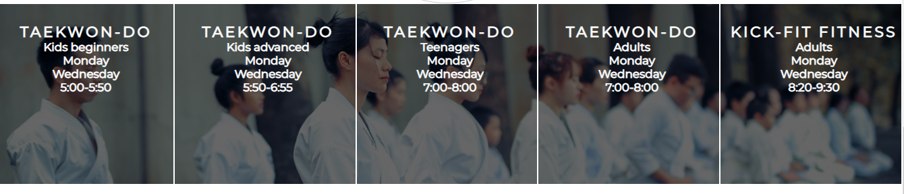
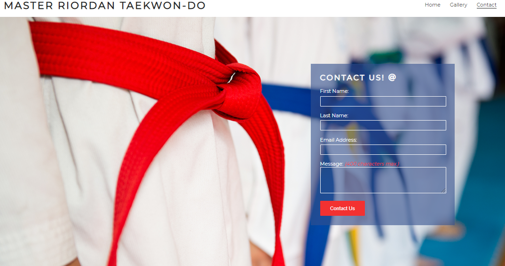
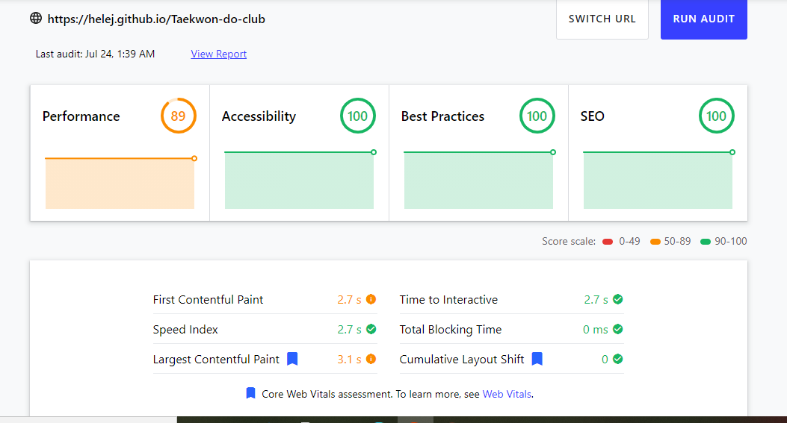
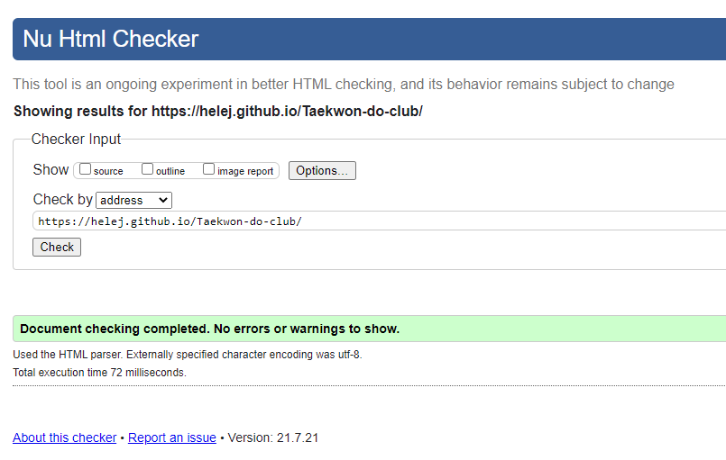
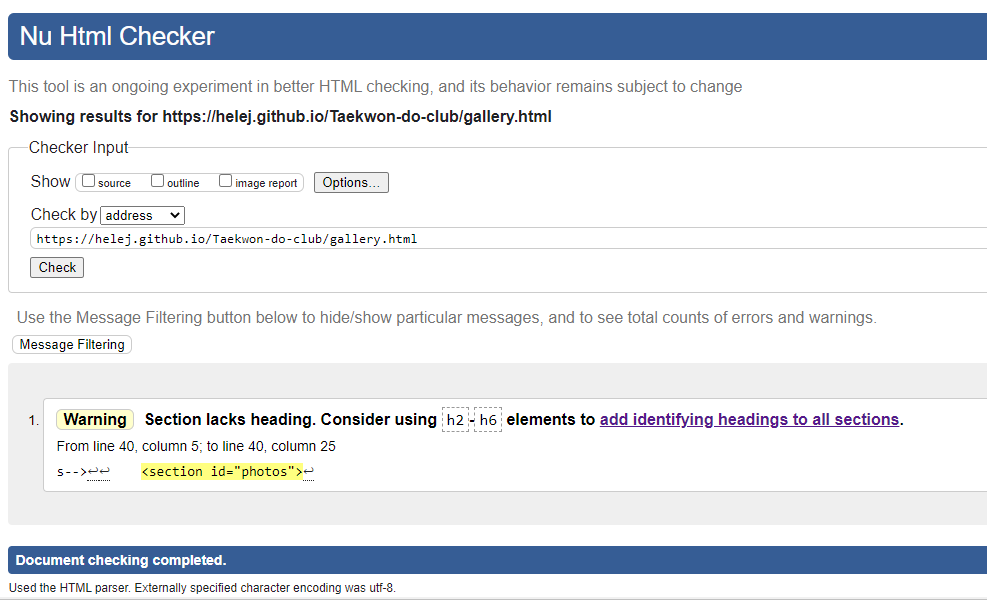
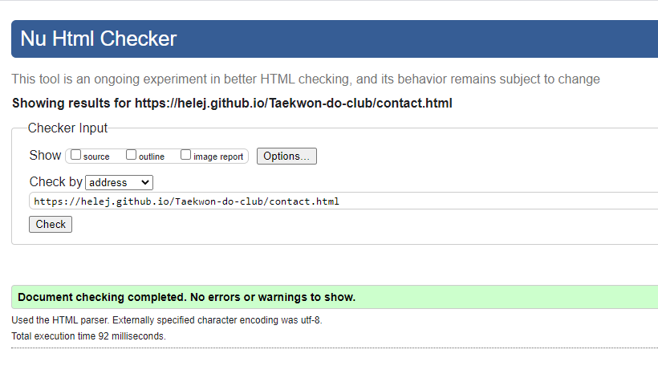
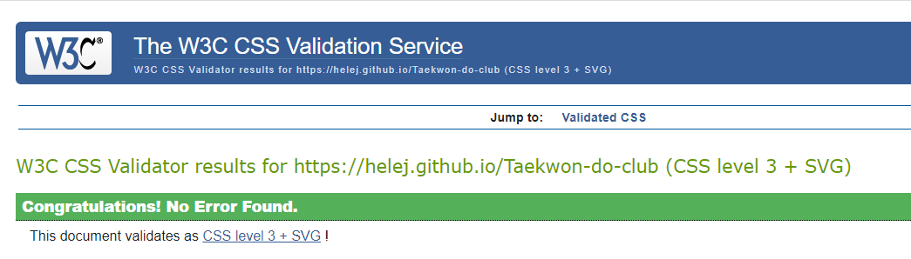

# My very first website

## Welcome to my very first website!

This website was built as part of the learning material for Code Institute's Fullstack Web Developer program.

You can check out the website [here!](https://helej.github.io/Taekwon-do-club)

## Project Description
This site was created in order to get familiar with common development tools like Cloud9, Git & GitHub, and how to use them to write and manage code. The project itself will display a breakdown of the different technologies used in each of the different sections of the program

## Technology
This project was written in HTML & CSS using GitHub.

# Table of contents
1. Introduction
2. Design  
3. Features
4. Future Features
5. Testing
6. Deploiment
7. Credits

##  Introduction
* Master Riordan Taekwon-do club page is for Master Riordan taekwon-do club members but also for people who looking for to become a member. 
* The page is about the club, it's health benefits, training times, links to social media and includes a contact form for inquieries or messages. 
* The gallery is for pictures to inspire, show club training and activities.

## Design

### Colour scheme

* My colour scheme is inspired by Taekwondo belt colours:

White Belt
Signifies innocence, as that of the beginning student who has no previous knowledge of Taekwondo.

Blue Belt
Signifies the Heaven towards which the plant matures into a towering tree as training in Taekwondo progresses. 

Red Belt
Signifies Danger, cautioning the student to exercise control and warning the opponent to stay away.

Black Belt
Opposite of white, therefore signifying the maturity and proficiency in Taekwondo, also indicates the wearer’s imperviousness to darkness and fear.

* "BLACK BELT IS A WHITE BELT WHO NEVER QUIT."

* white  #fafafa
* Cover text background colour, h2 heading and footer: blue  rgba(52, 80, 141)
* Contact button: red  #f33131
* Main text: black  #252525

As Taekwondo originates from Korea their flag colours are white, black, red and blue as well.

White backround symbolizing Korean people who was known as people who wearing white clothes. 

It also means symbolizing brighness, purity and peace.

## Features

* Featured at the top of the page, the navigation bar shows the club name in the left corner: Master Riordan Taekwon-do Club.
* The other navigation links on the right are: Home, Gallery and Contact which link to different sections of the same page.
* The navigation clearly tells the user the name of the club and website. Which makes the different sections of information easy to find.

* The header has a background image of a child wearing a Taekwon-do uniform to show that this club is a childfriendly club. The picture was taken outside symbolizing the idea that Taekwon-do isn't just a sport, Taekwon-do is a martial art which means that one part is training and competitions but the lifestyle and the art of living is just as important.

* Background image also has animation zoom effect what creates a welcoming feeling.

* The cover text provides information about the Clubs name and what of kind classes are provided.

* The benfits section shows that this club and taekwon-do practise benefits all age groups.

* This section is divided into three parts. Left side with physical health benefits, right side with menthal health benefits and in the middle is IUTF logo.

* The timetable section has a backround image which has a neutral calming feeling when a group of students are sitting with their eyes closed and are having a moment for internal reflection. As in classes students improve their physical and mental strenght.

* Section gives information about training times.

* The footer includes social media icons. Users can find their Taekwon-do club on facebook, instagramm, twitter and youtube.

* This page provides space to upload images from training sessions, graidings, competitions and other illustrative images to show activitis in this club.

* Contact page comes with supportive backround image.

* This page consist form-section. Contact form collects first name, surename and email address for sending message.

## Future Features

* Add to the existing Contact page a map.
* Add new Student Area Page where there are sections for grading, patterns, tenets, history of Taekwondo. Materials what are useful for students.

# Testing

1. Manual testing

* Checking responsivness

I confirmed that this project is responsive, looks good on functions on all standard secreen sizes using devtools device toolbar.

* Browser Validation

I tested that this page works in different browsers: Chrome and Internet Explorer

* I have confirmed that the navigation, header, benefits section, timetable section and contact form are all readable and easy to understand.

* I have conformed that the form works, requires entries in every field, will only accept an email in the email field, and the contact us button works.

2. Automated testing
* Code validation
* Lighthouse auditing

## Bugs

While i was working with my gitpod workspace Readme.md file was frozen, it would only open for a split second. I tried opening it, closing it and restarting my laptop but nothing worked.

I needed to open a new workspace to continue working.

## Validator 

https://validator.w3.org/nu/?doc=https://helej.github.io/Taekwon-do-club/index.html

https://validator.w3.org/nu/?doc=https://helej.github.io/Taekwon-do-club/contact.html

https://validator.w3.org/nu/?doc=https://helej.github.io/Taekwon-do-club/gallery.html

# Deploiment

The site was deployed to GitHub pages. The steps to deploy are as follows:
* From the Github repository, navigate to the Setting tab
* From the source section drop-down menuw, select the Master Branch
* Once the master has been selected, the page provided the link to the comleted website.

The live link can be found here - [Taekwon-do-Club](https://helej.github.io/Taekwon-do-club)

# Credits

## Content

* The code to make my first project was taken from the [Love Running](https://github.com/HeleJ/love-running/blob/master/index.html) Project.

## Media

* The images in the gallery page was t aken from [Pexels](https.pexels.com/search/taekwondo/)
